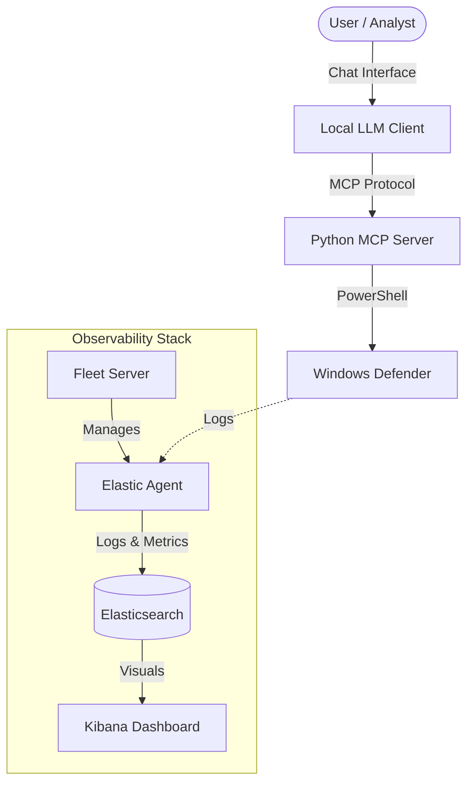

# Architecture & Resource Guide

This document outlines the system architecture and hardware requirements for **Elastic-GenAI-SOC**.

## System Architecture

The following diagram illustrates how the components interact:

### Components Role
1.  **Local LLM Client**: The brain. It processes user queries (e.g., "Is my system safe?") and decides which tool to call.
2.  **MCP Server**: The bridge. It translates LLM tool calls into actual PowerShell commands.
3.  **Windows Defender**: The enforcer. Executes scans and provides status.
4.  **Elastic Stack**: The memory. Records all activities, logs, and system metrics for historical analysis.

---

## Resource Requirements

### 1. Endpoint (The Machine being protected)
This is where the MCP Server and Windows Defender run.
*   **OS**: Windows 10/11 or Windows Server 2019+.
*   **CPU**: 2+ Cores (Standard usage).
*   **RAM**: 4GB+ (Reserved for OS + Agent + Python Server).
*   **Disk**: Adequate space for OS logs.

### 2. LLM Node (The Brain)
If you are running the LLM locally (e.g., Ollama with Llama 3 or Qwen 2.5):
*   **Model Size**: 7B / 8B Parameters.
*   **RAM**: Minimum **8GB** (16GB Recommended) dedicated to the model logic if running on CPU.
*   **GPU (Optional but Recommended)**: NVIDIA GPU with 6GB+ VRAM for faster responses.

### 3. Elastic Stack (The Observer)
You can host this on the same machine (if powerful enough) or a separate server/cloud.
*   **Minimum (PoC/Dev)**:
    *   2 vCPUs
    *   4GB RAM (Java Heap relies heavily on RAM).
    *   30GB Disk.
*   **Recommended (Production-like)**:
    *   4 vCPUs
    *   8GB+ RAM.
    *   SSD Storage.

## Scalability
- **Agents**: You can deploy the Elastic Agent to hundreds of Windows endpoints.
- **MCP Server**: Currently designed as a 1:1 relationship with an endpoint (running locally on the machine you want to manage). For remote management of many machines via one LLM, a centralized API approach would be needed in Version 2.0.
