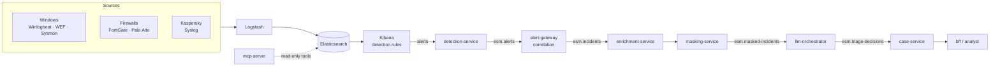

# Elastic-SecOps-Mastery


An open, AI-assisted Security Operations platform built on the **Basic-licensed Elastic Stack**.
Logs are collected and parsed with Logstash and Beats, Elastic detection rules raise alerts, alerts are
correlated into incidents, personal data is masked, and an LLM suggests a triage decision that an
analyst reviews. The LLM never acts on its own.

> **Status:** this repository consolidates three earlier projects (an Ubuntu ELK installer,
> an MCP-based GenAI SOC prototype, and the Vigil AI-SOC platform). The consolidation runs in phases;
> see [ROADMAP.md](ROADMAP.md) for what works today and what is still in progress.

## Architecture



Design rules (see [CLAUDE.md](CLAUDE.md) and the [ADRs](docs/architecture/adr/README.md)):
one LLM call per incident, never per alert; only masked data reaches the LLM; LLM output is
schema-validated JSON and every call is audited; only Basic-tier Elastic features.

## Flexible by design

Choose **what** to install (profile) independently of **where** it runs (target).

| Axis | Options | Status |
| --- | --- | --- |
| Profile | `siem` | Available (Compose, bare metal) |
| Profile | `siem` + platform layer (AI triage pipeline) | Available (Compose) |
| Target: bare-metal Ubuntu 22.04 | `deploy/baremetal/ubuntu/` | Available (`siem`) |
| Target: Docker Compose | `deploy/compose/siem.yml`, `platform.yml` | Available |
| Target: Kubernetes (ECK 3.5 + kustomize) | `deploy/kubernetes/overlays/` lab · onprem · gke | Available: `lab` tested end to end on kind; `onprem`, `gke` schema-validated |
| LLM provider | `mock` · `ollama` · `openai-compatible` · `anthropic` · `vertex` | Available: `mock` and `openai-compatible` (DeepSeek) tested end to end; `ollama`, `anthropic` tested against mocked HTTP only; `vertex` untested |
| Message bus | NATS JetStream | Available |
| Message bus | GCP Pub/Sub | Planned |
| MCP access | read-only, masked tools; stdio or bearer-token HTTP | Available |

## Repository layout

| Path | Contents |
| --- | --- |
| [`services/`](services) | Platform microservices: Go (detection-service, alert-gateway, case-service, bff) and Python (enrichment-service, masking-service, llm-orchestrator, mcp-server) |
| [`libs/`](libs) | Shared code: message contracts, NATS bus, Elasticsearch client (`go-common`, `py-common`) |
| [`content/`](content) | Elastic content loaded by `content/bootstrap.sh`: detection rules, ILM policy, component templates, roles |
| [`integrations/sources/`](integrations/sources) | One folder per log source: Logstash pipeline and collector configuration |
| [`deploy/`](deploy) | Deployment targets: `compose/`, `kubernetes/`, `baremetal/ubuntu/`, `endpoints/windows/` (GPO agent rollout) |
| [`docs/`](docs) | Guides, component references, deep dives and architecture decisions |

## Quick start

**SIEM with Docker Compose** (Elasticsearch, Kibana, Logstash, detection rules; needs ~4 GB RAM for Docker):

```bash
git clone https://github.com/yusufarbc/Elastic-SecOps-Mastery.git
cd Elastic-SecOps-Mastery/deploy/compose
./init-env.sh                      # Windows: .\init-env.ps1  (creates .env with random passwords)
docker compose -f siem.yml up -d
```

Open <http://localhost:5601> and log in as `elastic` with `ELASTIC_PASSWORD` from `deploy/compose/.env`.
Send a test event with `logger -n localhost -P 5514 -d "hello esm"` and find it in Discover (`logs-*`).
Then connect real sources: [integrations/sources](integrations/sources/README.md).

**SIEM on a single Ubuntu 22.04 host:**

```bash
sudo ./deploy/baremetal/ubuntu/elk_setup_ubuntu_jammy.sh
```

See [docs/deployment/baremetal.md](docs/deployment/baremetal.md).

**AI triage pipeline** on top of the SIEM (mock LLM by default; see [docs/genai/triage-pipeline.md](docs/genai/triage-pipeline.md)):

```bash
cd deploy/compose
docker compose -f siem.yml -f platform.yml up -d --build
python ../../tests/e2e/pipeline_test.py        # optional end-to-end check
```

Cases are served at <http://localhost:8080/api/cases>.
The same stack exposes a read-only, masked [MCP server](docs/genai/mcp-server.md) on
`http://localhost:8090/mcp` for Claude Desktop, Claude Code and other MCP clients.

**Kubernetes with ECK** (same profiles; `lab` runs on kind, k3d or Docker Desktop):

```bash
./deploy/kubernetes/init-secrets.sh lab
kubectl kustomize --load-restrictor LoadRestrictionsNone deploy/kubernetes/overlays/lab \
  | kubectl apply --server-side --force-conflicts -f -
```

See [docs/deployment/kubernetes.md](docs/deployment/kubernetes.md) for ECK installation and the onprem / gke overlays.

## Documentation

- Architecture: [overview](docs/architecture/overview.md) · [decision records](docs/architecture/adr/README.md)
- Deployment: [bare metal](docs/deployment/baremetal.md) · [Kubernetes](docs/deployment/kubernetes.md)
- Components: [Elasticsearch](docs/components/elasticsearch.md) · [Kibana](docs/components/kibana.md) · [Logstash](docs/components/logstash.md)
- Integrations: [Windows audit policy](docs/integrations/windows-audit-policy.md)
- GenAI: [triage pipeline](docs/genai/triage-pipeline.md) · [MCP server](docs/genai/mcp-server.md)
- Operations: [troubleshooting](docs/operations/troubleshooting.md)
- Deep dives: [history](docs/deep-dives/history-and-evolution.md) · [Elasticsearch internals](docs/deep-dives/elasticsearch-internals.md) · [ingestion](docs/deep-dives/ingestion-architecture.md) · [Kibana internals](docs/deep-dives/kibana-internals.md) · [security architecture](docs/deep-dives/security-architecture.md) · [comparative analysis](docs/deep-dives/comparative-analysis.md)

## License

[Apache License 2.0](LICENSE). See [NOTICE](NOTICE).
