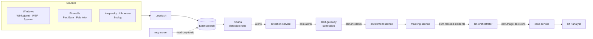

# Elastic-SecOps-Mastery


An open, AI-assisted Security Operations platform built on the **Basic-licensed Elastic Stack**.
Logs are collected and parsed with Logstash and Beats, Elastic detection rules raise alerts, alerts are
correlated into incidents, personal data is masked, and an LLM suggests a triage decision that an
analyst reviews. The LLM never acts on its own.

> **Status:** this repository consolidates three earlier projects (an Ubuntu ELK installer,
> an MCP-based GenAI SOC prototype, and the Vigil AI-SOC platform). The consolidation runs in phases;
> see [ROADMAP.md](ROADMAP.md) for what works today and what is still in progress.

## Architecture



Design rules (see [CLAUDE.md](CLAUDE.md) and the [ADRs](docs/architecture/adr/README.md)):
one LLM call per incident, never per alert; only masked data reaches the LLM; LLM output is
schema-validated JSON and every call is audited; only Basic-tier Elastic features.

## Flexible by design

Choose **what** to install (profile) independently of **where** it runs (target).

| Axis | Options | Status |
| --- | --- | --- |
| Profile | `siem` · `ai-lite` · `full` | Planned (Phase 3) |
| Target: bare-metal Ubuntu 22.04 | `deploy/baremetal/ubuntu/` | Available; Logstash pipeline issues fixed in Phase 2 |
| Target: Docker Compose | `deploy/compose/` | Service builds fixed in Phase 4; layered profiles in Phase 3 |
| Target: Kubernetes (ECK) | `deploy/kubernetes/` lab, on-prem, GKE | Manifests available; kustomize overlays in Phase 3 |
| LLM provider | `mock` · `vertex` | Available |
| LLM provider | `ollama` · `openai-compatible` · `anthropic` | Planned (Phase 4) |
| Message bus | NATS JetStream · GCP Pub/Sub | Planned (Phase 4) |

## Repository layout

| Path | Contents |
| --- | --- |
| [`services/`](services) | Platform microservices: Go (detection-service, alert-gateway, case-service, bff) and Python (enrichment-service, masking-service, llm-orchestrator, mcp-server) |
| [`content/`](content) | Elastic content: detection rules, Fleet policies (templates, ILM, dashboards and hunting queries in later phases) |
| [`integrations/sources/`](integrations/sources) | One folder per log source: Logstash pipeline and collector configuration |
| [`deploy/`](deploy) | Deployment targets: `compose/`, `kubernetes/`, `baremetal/ubuntu/`, `endpoints/windows/` (GPO agent rollout) |
| [`docs/`](docs) | Guides, component references, deep dives and architecture decisions |

## Quick start

**Single-host SIEM on Ubuntu 22.04** (Elasticsearch, Kibana, Logstash):

```bash
git clone https://github.com/yusufarbc/Elastic-SecOps-Mastery.git
cd Elastic-SecOps-Mastery
sudo ./deploy/baremetal/ubuntu/elk_setup_ubuntu_jammy.sh
```

See [docs/deployment/baremetal.md](docs/deployment/baremetal.md).

**Platform development stack** (Docker Compose, mocked LLM). The service images do not build yet
(empty `go.sum` files, invalid Python build backend); this is fixed in Phase 4:

```bash
cp .env.example .env
make up      # Kibana on :5601, BFF on :8080
make test    # unit tests
```

**Kubernetes with ECK:** see [docs/deployment/kubernetes.md](docs/deployment/kubernetes.md).

## Documentation

- Architecture: [overview](docs/architecture/overview.md) · [decision records](docs/architecture/adr/README.md)
- Deployment: [bare metal](docs/deployment/baremetal.md) · [Kubernetes](docs/deployment/kubernetes.md)
- Components: [Elasticsearch](docs/components/elasticsearch.md) · [Kibana](docs/components/kibana.md) · [Logstash](docs/components/logstash.md)
- Integrations: [Windows audit policy](docs/integrations/windows-audit-policy.md)
- GenAI: [MCP server](docs/genai/mcp-server.md)
- Operations: [troubleshooting](docs/operations/troubleshooting.md)
- Deep dives: [history](docs/deep-dives/history-and-evolution.md) · [Elasticsearch internals](docs/deep-dives/elasticsearch-internals.md) · [ingestion](docs/deep-dives/ingestion-architecture.md) · [Kibana internals](docs/deep-dives/kibana-internals.md) · [security architecture](docs/deep-dives/security-architecture.md) · [comparative analysis](docs/deep-dives/comparative-analysis.md)

## License

[Apache License 2.0](LICENSE). See [NOTICE](NOTICE).
