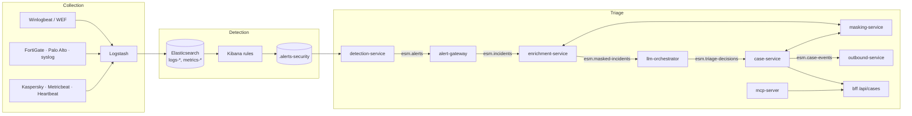

[← Back to README](../../README.md)

# Architecture overview

Elastic GenAI SecOps has three layers. Each works without the one above it.

| Layer | Components | Profile |
| --- | --- | --- |
| Collection | Beats / WEF / syslog senders → Logstash pipelines in `integrations/sources` | `siem` |
| Detection | Elasticsearch data streams, Kibana Security detection rules (`content/detection-rules`) | `siem` |
| Triage | NATS + platform services: incident correlation, masking, LLM triage, cases, MCP, outbound | `siem` + platform |

## Principles

The [design rules](../../ROADMAP.md#design-rules) shape every component:

- **Deterministic core.** Detection rules and correlation decide; the LLM only suggests. Every case
  waits for an analyst; nothing acts on LLM output ([ADR-002](adr/002-deterministic-core-human-in-the-loop.md)).
- **One LLM call per incident**, never per alert or log ([ADR-001](adr/001-llm-per-incident.md)).
- **Masked, curated input.** Hosts, users and IPs are pseudonymized; free text such as command
  lines never reaches the LLM ([ADR-004](adr/004-mandatory-pii-masking.md)).
- **Everything audited.** Every LLM call is stored in `esm-llm-audit`.
- **Basic license only** ([ADR-014](adr/014-elastic-basic-tier-features.md)).
- **Portable.** Profiles are independent of targets: Compose, Kubernetes (ECK), bare-metal Ubuntu
  ([ADR-019](adr/019-deployment-profiles-and-targets.md)); NATS or Pub/Sub ([ADR-017](adr/017-portable-message-bus.md));
  five LLM providers ([ADR-018](adr/018-multiple-llm-providers.md)).

## Data in Elasticsearch

| Index / data stream | Written by | Contents |
| --- | --- | --- |
| `logs-<source>-<namespace>` | Logstash | Events from each source (`windows`, `fortigate`, `paloalto`, `syslog`, `kaspersky`, `heartbeat`) |
| `metrics-metricbeat-<namespace>` | Logstash | Host metrics |
| `.alerts-security.alerts-default` | Kibana | Detection alerts |
| `esm-state` | detection-service | Alert polling checkpoint |
| `esm-masking-maps` | masking-service | Token ↔ plaintext reverse maps (the only plaintext mapping) |
| `esm-llm-audit` | llm-orchestrator | Masked prompt, response, model, tokens, latency, outcome per call |
| `esm-cases` | case-service | Cases and analyst reviews |

Logs and metrics use the ILM policy `esm-logs` (rollover, delete after `RETENTION_DAYS`).

## Users and roles

| User | Role | Used by |
| --- | --- | --- |
| `elastic` | superuser | administrators, bootstrap |
| `kibana_system` | built-in | Kibana |
| `logstash_ingest` | `logstash_writer`: create documents in `logs-*-*`, `metrics-*-*` | Logstash pipelines |
| `esm_platform` | `esm_platform`: read alerts, logs and metrics; own `esm-*` | platform services, MCP server |

Roles live in `content/elasticsearch/roles`; `content/bootstrap.sh` creates them on every target.

## Message bus

NATS JetStream stream `ESM` with subjects `esm.alerts`, `esm.incidents`, `esm.masked-incidents`,
`esm.triage-decisions`, `esm.case-events` and `esm.dlq`. Consumers are durable, acknowledge
explicitly, and move a message to `esm.dlq` after five failed deliveries. Message IDs are scoped
per subject so redeliveries are deduplicated. Contracts: `libs/go-common/contracts` and
`libs/py-common/esm_common/contracts.py`.

## Where to go next

- Deployment: [Compose](../../README.md#quick-start) · [bare metal](../deployment/baremetal.md) · [Kubernetes](../deployment/kubernetes.md)
- Pipeline details: [triage-pipeline.md](../genai/triage-pipeline.md)
- Decision records: [adr/](adr/README.md)
