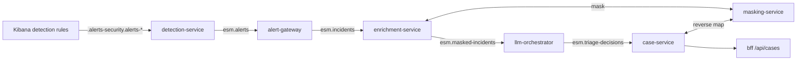

[← Back to README](../../README.md)

# AI-assisted triage pipeline

The platform layer turns Kibana Security alerts into analyst cases with an LLM triage suggestion.
The LLM never acts: every case waits for an analyst decision.



| Service | Language | Does | Stores |
| --- | --- | --- | --- |
| detection-service | Go | Polls open alerts, normalizes them, extracts MITRE techniques | checkpoint in `esm-state` |
| alert-gateway | Go | Groups alerts by host + user + first technique within `CORRELATION_WINDOW`; emits early at `CORRELATION_THRESHOLD` alerts; risk score | in memory |
| enrichment-service | Python | Builds the curated incident: masked identifiers, timeline (max 50), deterministic summary. Free-text fields such as command lines are never forwarded | – |
| masking-service | Python | Deterministic pseudonyms (`host_1a2b3c`) and the only reverse map; maps expire after `MASKING_MAP_TTL_HOURS` (default 14 days, ADR-025) | `esm-masking-maps` |
| llm-orchestrator | Python | The only LLM caller: one call per incident, JSON schema validation, retries, token budget per window, audit log | `esm-llm-audit` |
| case-service | Go | Un-masks the decision, creates the case, records analyst reviews and then deletes the incident's reverse map | `esm-cases` |
| bff | Go | Thin analyst API in front of case-service | – |

Messages travel over NATS JetStream (stream `ESM`, subjects `esm.*`, ADR-017). A message that fails
five times is moved to `esm.dlq`. Every masked incident produces a triage result, also when the
budget is exhausted (`budget_exceeded`) or the LLM keeps failing (`llm_failed`); those cases are
marked for analyst triage.

## Run it

```bash
cd deploy/compose
./init-env.sh                       # Windows: .\init-env.ps1
docker compose -f siem.yml -f platform.yml up -d --build
python ../../tests/e2e/pipeline_test.py   # optional end-to-end check (about 5-10 minutes)
```

Cases: `GET http://localhost:8080/api/cases?review_status=pending`, details at `/api/cases/{id}`,
analyst decision with `POST /api/cases/{id}/review` and `{"status": "approved|rejected", "analyst": "...", "notes": "..."}`.

## Choosing the LLM

Set these in `deploy/compose/.env` and recreate `llm-orchestrator`
(`docker compose -f siem.yml -f platform.yml up -d llm-orchestrator`):

| `LLM_PROVIDER` | `LLM_MODEL_ID` example | `LLM_BASE_URL` default | `LLM_API_KEY` |
| --- | --- | --- | --- |
| `mock` (default) | – | – | – |
| `ollama` | `llama3.1:8b`, `qwen2.5:7b` | `http://ollama:11434` | – |
| `openai-compatible` | `gpt-4o-mini`, or a vLLM / LM Studio model | `https://api.openai.com/v1` | required for OpenAI |
| `openai-compatible` | `deepseek-flash` (DeepSeek, tested end to end) | set `https://api.deepseek.com` | required |
| `anthropic` | `claude-haiku-4-5` | `https://api.anthropic.com` | required |
| `vertex` | `gemini-2.5-flash` | – (uses `GCP_PROJECT`, `VERTEX_LOCATION`) | Workload Identity |

The model ID always comes from configuration, never from code. `vertex` needs the optional
`google-cloud-aiplatform` dependency (`pip install "llm-orchestrator[vertex]"`), which the default
image does not include.

For a local model, run Ollama on the Docker host and set `LLM_BASE_URL=http://host.docker.internal:11434`.

## What the LLM sees

Only the `MaskedIncident`: pseudonymized hosts, users and IPs (with a private/external flag),
the alert timeline (rule, severity, masked host and user), MITRE techniques, risk score and a
pre-aggregated summary. Every call is written to `esm-llm-audit` with the full masked prompt, the
response, model, token counts, latency and outcome.

## Limits (see ROADMAP.md)

- alert-gateway keeps open correlation windows in memory; alerts of an unfinished window are lost on restart.
- The GCP Pub/Sub bus adapter is not implemented yet (`BUS_BACKEND=nats` only).
- No asset-criticality or GeoIP enrichers yet.
