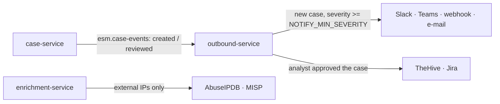

[← Back to README](../../README.md)

# Outbound integrations: notifications, ticketing, threat intel

Code: [`integrations/outbound`](../../integrations/outbound) (adapters) and
[`services/outbound-service`](../../services/outbound-service). Decisions: [ADR-023](../architecture/adr/023-outbound-integrations.md).



Every adapter only informs or records. Nothing isolates a host, blocks an address or disables an
account; those actions stay with analysts.

## Notifications

Sent when a case is created (`NOTIFY_ON=created`) and its severity is at least
`NOTIFY_MIN_SEVERITY` (default `high`).

| Channel | Settings |
| --- | --- |
| Slack | `SLACK_WEBHOOK_URL` (incoming webhook) |
| Microsoft Teams | `TEAMS_WEBHOOK_URL` (Workflows webhook, Adaptive Card) |
| Generic webhook | `WEBHOOK_URL`, optional `WEBHOOK_TOKEN` (sent as `Authorization: Bearer`) |
| E-mail | `SMTP_HOST`, `SMTP_PORT` (587), `SMTP_FROM`, `SMTP_TO` (comma separated), `SMTP_USER`, `SMTP_PASSWORD`, `SMTP_STARTTLS` (true) |

`NOTIFY_DETAIL=summary` (default) sends severity, risk score, alert count, triage and review state,
MITRE techniques, rule names and a link (`CASE_URL`). Hosts, users, IP addresses and the LLM summary
are left out because chat and e-mail providers are usually outside your network. Set
`NOTIFY_DETAIL=full` only for internal channels.

Notifications are best effort: a failed channel is logged and not retried, so the other channels
are not notified twice.

## Ticketing

Created when an analyst **approves** a case (`TICKET_ON=approved`, default). `TICKET_ON=created`
opens a ticket for every new case; `never` disables ticketing. Tickets use `TICKET_DETAIL=full` by
default (entities, LLM summary, suggested actions, analyst notes).

| System | Settings | Duplicate protection |
| --- | --- | --- |
| TheHive 5 | `THEHIVE_URL`, `THEHIVE_API_KEY` | alert `sourceRef` = case ID |
| Jira (Cloud / Data Center) | `JIRA_URL`, `JIRA_USER`, `JIRA_API_TOKEN`, `JIRA_PROJECT`, `JIRA_ISSUE_TYPE` (Task) | label `esm-<case id>` searched before creating |

A failed ticket call is retried through the message bus (up to 5 deliveries, then `esm.dlq`).

## Threat intelligence

`enrichment-service` looks up **external** source IPs (never private addresses, at most 20 per
incident) and adds a deterministic verdict to the masked incident, e.g.
`threat intel: 1 of 2 external IP(s) flagged malicious`. The LLM sees the verdict and the masked
token, not the address. Results are cached for an hour; a provider outage never blocks an incident.

| Source | Settings | Malicious when |
| --- | --- | --- |
| AbuseIPDB | `ABUSEIPDB_API_KEY`, `ABUSEIPDB_MIN_SCORE` (50) | abuse confidence score >= minimum |
| MISP | `MISP_URL`, `MISP_API_KEY`, `MISP_VERIFY_TLS` (true) | an `ip-src`/`ip-dst` attribute with `to_ids` matches |

## Configure

**Compose:** set the variables in `deploy/compose/.env` (all empty by default) and run
`docker compose -f siem.yml -f platform.yml up -d outbound-service enrichment-service`.

**Kubernetes:** non-secret settings (`NOTIFY_*`, `TICKET_*`) are in `esm-platform-config`; put URLs
and keys in the optional Secret `esm-outbound`:

```bash
kubectl -n esm create secret generic esm-outbound \
  --from-literal=SLACK_WEBHOOK_URL=https://hooks.slack.com/services/... \
  --from-literal=ABUSEIPDB_API_KEY=...
kubectl -n esm rollout restart deployment outbound-service enrichment-service
```

## Test without real accounts

[`tests/e2e/webhook_catcher.py`](../../tests/e2e/webhook_catcher.py) records every request. Run it on
the compose network, point `SLACK_WEBHOOK_URL`, `WEBHOOK_URL` and `THEHIVE_URL` at
`http://catcher:8000/...`, run `tests/e2e/pipeline_test.py` (it approves the case at the end) and
read `http://catcher:8000/received`.
