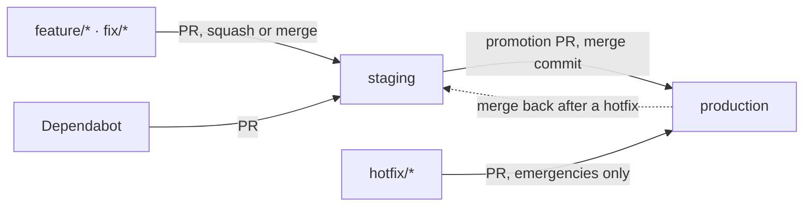
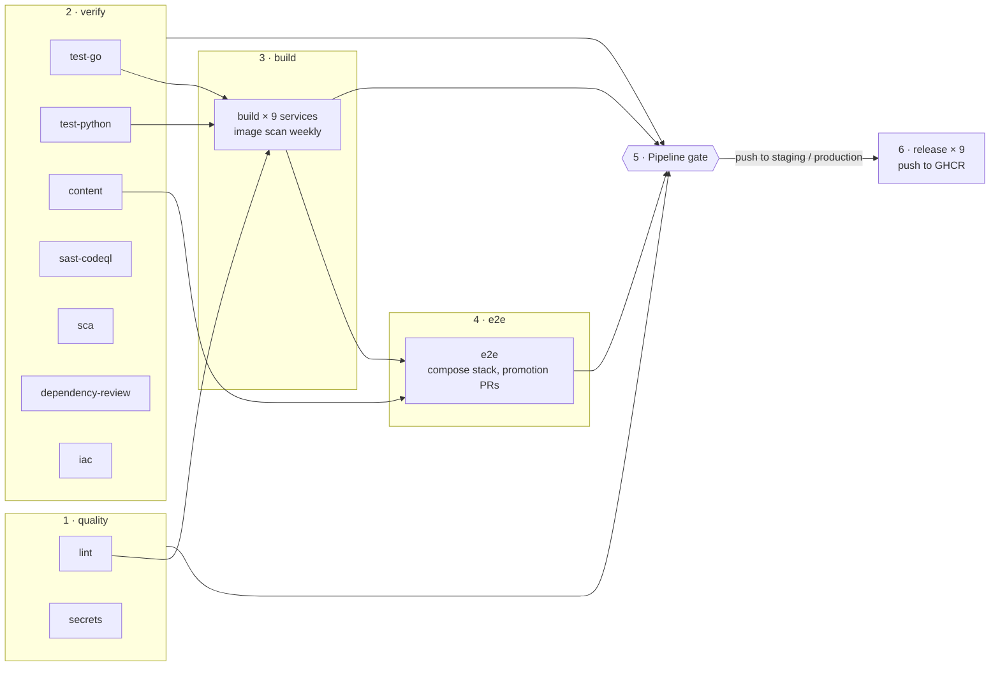

# CI/CD and DevSecOps pipeline

Every change to this repository is built, tested and security-scanned by one GitHub Actions
workflow, [`.github/workflows/pipeline.yml`](../../.github/workflows/pipeline.yml). This page
explains the branch flow, what each stage checks, how to read and tune the results, and how to
reproduce the checks locally. The decision records are
[ADR-024](../architecture/adr/024-staging-production-pipeline.md) (branch flow) and
[ADR-026](../architecture/adr/026-right-sized-pipeline.md) (which checks run, and when).

## Contents

- [Branch flow](#branch-flow)
- [Pipeline at a glance](#pipeline-at-a-glance)
- [Stages in detail](#stages-in-detail)
- [When it runs](#when-it-runs)
- [Results: where to look](#results-where-to-look)
- [Published images](#published-images)
- [Repository settings the pipeline relies on](#repository-settings-the-pipeline-relies-on)
- [Running the checks locally](#running-the-checks-locally)
- [Pipeline hardening](#pipeline-hardening)
- [Tuning a gate](#tuning-a-gate)
- [Troubleshooting](#troubleshooting)
- [Adding a service](#adding-a-service)
- [Deployment](#deployment)

## Branch flow

The repository keeps exactly two long-lived branches:

| Branch | Role |
| --- | --- |
| `production` | Default branch and release line. Every commit here has passed the full pipeline twice: once on its way into `staging`, once on promotion. |
| `staging` | Integration branch. Changes land here first and are verified together before promotion. |



1. Branch from `staging`, push, and open a pull request **into `staging`**.
2. The pipeline runs. When the `Pipeline gate` check is green, merge. The feature branch is then deleted.
3. To release, open a pull request **from `staging` into `production`** and merge it with a merge
   commit (not squash, so `staging` and `production` keep a shared history).
4. `hotfix/*` branches may target `production` directly; merge `production` back into `staging`
   afterwards.

The `Guard · promotion path` job rejects any other pull request into `production`.

### Branch protection

Both branches are protected by repository rulesets, stored as code in
[`.github/rulesets/`](../../.github/rulesets) and active on GitHub:

| Rule | `staging` | `production` |
| --- | --- | --- |
| Changes only through pull requests | yes | yes |
| Required check: `Pipeline gate` | yes | yes, and the branch must be up to date |
| Unresolved review conversations block the merge | yes | yes |
| Allowed merge methods | squash, merge | merge |
| Force push / deletion | blocked | blocked |
| Bypass | nobody | nobody |

No approving review is required, because the project has a single maintainer and GitHub does not
let authors approve their own pull requests. Raise `required_approving_review_count` in the JSON
files when more maintainers join. To change a ruleset, edit its JSON file and apply it:

```bash
gh api repos/{owner}/{repo}/rulesets --jq '.[] | "\(.id) \(.name)"'            # find the id
gh api -X PUT repos/{owner}/{repo}/rulesets/<id> --input .github/rulesets/production.json
```

## Pipeline at a glance



All quality and verify jobs start in parallel. Images are built only after lint and unit tests
pass, and the end-to-end stage reuses those exact images. A pull request into `staging` or a push
takes about 5–10 minutes. The promotion pull request into `production` also runs the end-to-end
stage and takes roughly 25 minutes, most of it waiting for Kibana's 5-minute rule schedule.

## Stages in detail

### 0 · Guard

| Job | What it checks | Fails when |
| --- | --- | --- |
| `promotion` | The source branch of a pull request into `production` | the source is not `staging` or `hotfix/*` |

### 1 · Quality

| Job | Tools | Fails when |
| --- | --- | --- |
| `lint` | `gofmt`, `go vet`, **golangci-lint** with **gosec** ([`.golangci.yml`](../../.golangci.yml)), **ruff**, **hadolint** (all Dockerfiles), **shellcheck** (installer and init scripts), **actionlint** (workflows) | any finding |
| `secrets` | **gitleaks** over the full git history | a secret that is not in [`.gitleaksignore`](../../.gitleaksignore) |

### 2 · Verify

| Job | Tools | Fails when |
| --- | --- | --- |
| `test-go` | `go test -race` with coverage; the total is shown in the run summary | a failing test or a data race |
| `test-python` | `pytest` with coverage, one job per Python service and `integrations/outbound` | a failing test |
| `content` | `build.py --check` for detection rules, `docker compose config`, kustomize + **kubeconform** against Kubernetes and ECK CRD schemas for the `lab`, `onprem`, `gke` overlays | invalid rules, compose files or manifests |
| `sast-codeql` | **CodeQL** `security-extended` for Go, Python and GitHub Actions | alerts are reported in the Security tab (the job fails only on analysis errors) |
| `sca` | **govulncheck** (Go vulnerabilities reachable from our code), **pip-audit** (every installed Python dependency) | a known vulnerability |
| `dependency-review` | GitHub dependency review, pull requests only | the PR adds a dependency with a HIGH or CRITICAL advisory |
| `iac` | **Trivy** misconfiguration scan of Dockerfiles, Kubernetes manifests and compose files | a HIGH or CRITICAL misconfiguration |

### 3 · Build

One `build` job per service (`detection-service`, `alert-gateway`, `case-service`, `bff`,
`masking-service`, `enrichment-service`, `llm-orchestrator`, `mcp-server`, `outbound-service`):

1. Build the image with Buildx, using the GitHub Actions layer cache. The image is tagged
   `esm/<service>:dev`, the same tag that `deploy/compose/platform.yml` uses.
2. **Trivy image scan**, on the weekly run and on manual runs only: fails on HIGH or CRITICAL CVEs
   that have a fix available. Image CVEs come from the base images, which change between releases
   while our code does not.
3. Export the image as an artifact for the e2e and release jobs, so every later stage uses the
   exact bytes that were built.

### 4 · End-to-end

`e2e` runs the real system on the runner, on promotion pull requests into `production` and on
manual runs:

1. Load the nine images and start `siem.yml` + `platform.yml` with `--no-build` and
   `LLM_PROVIDER=mock`. Secrets come from `init-env.sh`, freshly generated per run.
2. **End-to-end test** ([`tests/e2e/pipeline_test.py`](../../tests/e2e/pipeline_test.py)): indexes
   synthetic Sysmon events, then waits for Kibana alert → detection-service → alert-gateway
   (correlation) → enrichment + masking → llm-orchestrator (mock) → case-service → bff. It checks
   that the case is un-masked for the analyst and that **no plaintext host, user or command line
   reached the LLM audit record**.
3. **MCP test** ([`tests/e2e/mcp_client_test.py`](../../tests/e2e/mcp_client_test.py)): the
   read-only tool set, masked case data, alert statistics and a hunt query.
4. All compose logs are uploaded as the `e2e-logs` artifact, also when the job fails.

### 5 · Gate

`Pipeline gate` depends on every job above and fails if any of them failed or was cancelled.
Skipped jobs are fine: for example, `dependency-review` runs only on pull requests and `e2e`
runs only on promotion pull requests. This job is the only required status check, so adding or
renaming jobs never requires a ruleset change.

### 6 · Release

Runs only on a **push** to `staging` or `production`, which in practice means a merged pull
request, and only when the gate passed. Per service, it pushes the image built in the same run
to GHCR (see [Published images](#published-images)) and prints the digest in the run summary.
Images are not signed and carry no SBOM or provenance attestation (ADR-026); add them when other
people deploy the published images.

The job runs in the GitHub Environment named after the branch (`staging` or `production`), which
is where a deploy step and its secrets will go later.

## When it runs

| Event | Stages |
| --- | --- |
| Pull request into `staging` | 0–3, 5: no e2e, no image scan |
| Pull request into `production` (promotion) | 0–5: including e2e |
| Push to `staging` or `production` (a merged PR) | 1–3, 5, 6: no e2e; images are rebuilt, then released |
| Weekly, Monday 03:17 UTC, on `production` | secrets, SAST, SCA, IaC, image scans and the gate |
| Manual (`workflow_dispatch`) | 1–5 on the chosen branch; release never runs, it needs a `push` |

Why not run everything everywhere:

- **e2e only on the promotion.** It takes about 20 minutes and tests what `staging` holds as a
  whole. The `production` ruleset requires the branch to be up to date, so the commit that lands
  after the merge is exactly the tree the promotion tested. Unit tests cover single changes into
  `staging`; run the e2e job by hand (`workflow_dispatch`) for risky ones.
- **Image scans weekly.** Image CVEs come from base images and OS packages, which Dependabot
  updates and the weekly run re-checks; scanning the same base image on every PR adds nothing.
- **The weekly run re-scans, it does not re-test.** Lint, unit tests and manifest validation give
  the same answer for unchanged code. Vulnerability databases and CodeQL queries do change, so
  those scans run again.

A newer commit on the same pull request cancels the run still in progress.

[`pages.yml`](../../.github/workflows/pages.yml) publishes the landing page in `website/` to
GitHub Pages. It is independent of the pipeline: it runs only when `website/` or the workflow file
changes on `production` (or by hand), is not a required check, and deploys only through the
`github-pages` environment, which accepts the `production` branch.

## Results: where to look

| What | Where |
| --- | --- |
| Overall result | The `Pipeline gate` check on the pull request |
| Failing job | Pull request → Checks → the red job → its log. Scanner jobs print one `::error` line per finding |
| SAST, IaC, image CVEs | **Security → Code scanning**, one category per tool (`codeql-go`, `codeql-python`, `codeql-actions`, `trivy-iac`, `trivy-image-<service>`). New findings are also annotated on the PR diff |
| Dependency advisories | **Security → Dependabot** |
| Go coverage, published digests | The workflow run's **Summary** page |
| Coverage file, compose logs | The workflow run's **Artifacts** (images 3 days, coverage 7 days, e2e logs 14 days). A repository SBOM can be exported from **Insights → Dependency graph** |

## Published images

| Branch | Image | Tags |
| --- | --- | --- |
| `production` | `ghcr.io/<owner>/elastic-secops-mastery/<service>` | `latest`, `<first 12 chars of the commit SHA>` |
| `staging` | same | `staging`, `<sha12>` |

The image name matches the Kubernetes manifests in
`deploy/kubernetes/components/platform/kustomization.yaml`. For a reproducible deployment, pin the
digest from the release job's summary instead of `latest`.

## Repository settings the pipeline relies on

| Setting | Why | Where |
| --- | --- | --- |
| Dependency graph and Dependabot alerts on | `dependency-review` fails with "not supported on this repository" otherwise | Settings → Code security |
| Repository is public (or GitHub Advanced Security) | CodeQL, SARIF upload and dependency review | Settings → General |
| Actions may create packages | GHCR push in the release job | the workflow requests `packages: write` itself |
| Rulesets `staging` and `production` active | enforce the branch flow | Settings → Rules, or `.github/rulesets/` |
| Dependabot targets `staging` | updates follow the normal promotion path | [`.github/dependabot.yml`](../../.github/dependabot.yml), grouped per ecosystem |

## Running the checks locally

Everything runs in containers, so only Docker is needed. From the repository root (in Git Bash
on Windows, prefix with `MSYS_NO_PATHCONV=1` and use `$(pwd -W)` instead of `$PWD`):

```bash
# Lint
docker run --rm -v "$PWD:/src" -w /src golangci/golangci-lint:v2.14.0 golangci-lint run ./...
pip install ruff && ruff check libs/py-common integrations/outbound services/
for f in services/*/Dockerfile; do docker run --rm -i hadolint/hadolint:v2.12.0 hadolint --ignore DL3042 - < "$f"; done
docker run --rm -v "$PWD:/repo" -w /repo rhysd/actionlint:1.7.12

# Secrets, SCA, IaC
docker run --rm -v "$PWD:/repo" ghcr.io/gitleaks/gitleaks:v8.30.1 git /repo --redact
docker run --rm -v "$PWD:/src" -w /src golang:1.26-alpine \
  sh -c 'go install golang.org/x/vuln/cmd/govulncheck@latest && /go/bin/govulncheck ./...'
docker run --rm -v "$PWD:/repo" aquasec/trivy:0.75.0 config --severity HIGH,CRITICAL /repo

# Image scan for one service
docker build -f services/bff/Dockerfile -t esm/bff:dev .
docker run --rm -v /var/run/docker.sock:/var/run/docker.sock aquasec/trivy:0.75.0 \
  image --severity HIGH,CRITICAL --ignore-unfixed esm/bff:dev
```

Unit tests and the end-to-end test are described in [CONTRIBUTING.md](../../CONTRIBUTING.md).

## Pipeline hardening

The pipeline itself is part of the supply chain, so it follows the same rules it enforces:

| Practice | How |
| --- | --- |
| Least-privilege token | The workflow default is `contents: read`; each job adds only what it needs (`security-events: write` for SARIF, `packages: write` only in `release`) |
| No persisted credentials | Every checkout uses `persist-credentials: false`; no job pushes with git |
| Pinned actions | Every action, first- and third-party, is pinned to a full commit SHA with the version as a comment; Dependabot updates them in a group |
| Pinned tools | Scanner images and CLI tools use fixed versions (`gitleaks`, `trivy`, `hadolint`, `actionlint`, `govulncheck`, `pip-audit`, `ruff`), so a gate cannot change behaviour without a reviewed pull request |
| Untrusted input stays data | Branch names and other event fields reach scripts through `env:`, never by `${{ }}` expansion inside `run:` |
| Built artifact = released artifact | The release job pushes the image built in the same run |
| Ephemeral secrets | The e2e stack generates fresh random credentials per run; no repository secrets are used |

## Tuning a gate

Fix the finding if you can. If it is a false positive or an accepted risk, suppress it as close to
the code as possible, with a reason that a reviewer can check:

| Tool | Suppression |
| --- | --- |
| gitleaks | add the fingerprint it prints to `.gitleaksignore`, with a comment. Fingerprints include the commit SHA, so re-map them after a history rewrite |
| golangci-lint / gosec | `//nolint:<linter> // reason` on the line, or a rule in `.golangci.yml` |
| ruff | `# noqa: <code>` on the line, or the service's `pyproject.toml` |
| hadolint | `# hadolint ignore=<rule>` above the instruction |
| Trivy (IaC or image) | add the ID to a `.trivyignore` at the repository root, with a reason and an expiry date |
| pip-audit | `--ignore-vuln <id>` in the `sca` job, with a reason in a comment |
| CodeQL | dismiss the alert in the Security tab with a reason |

Severity thresholds (HIGH/CRITICAL for Trivy, high for dependency review) are set in `pipeline.yml`. Lowering them is a pull request like any other change.

## Troubleshooting

| Symptom | Cause and fix |
| --- | --- |
| `golangci-lint`: "Go language version used to build golangci-lint is lower than the targeted Go version" | `go.mod` was raised past the toolchain golangci-lint was built with. Raise `version:` in the lint job. |
| CodeQL Go: "Go does not support the none build mode" | Go needs `autobuild`; the matrix sets it per language. |
| Trivy fails although the table shows no HIGH/CRITICAL | In SARIF mode trivy-action ignores `severity` unless `limit-severities-for-sarif: true` is set. |
| `dependency-review`: "not supported on this repository" | Turn on the dependency graph (see [settings](#repository-settings-the-pipeline-relies-on)). |
| e2e times out waiting for alerts | Kibana rules run every 5 minutes. Check `stack-logs.txt` in the `e2e-logs` artifact: usually Elasticsearch memory or the `rules` import container. |
| Merge blocked although `Pipeline gate` is green | The ruleset requires all review conversations to be resolved, and code scanning posts its findings as PR review comments. Fix the finding (the comment then resolves itself) or resolve the conversation with a reason. |
| CodeQL: "Unpinned tag for a non-immutable Action" | Third-party actions must be pinned to a full commit SHA with the version as a comment (`uses: owner/action@<sha> # vX.Y.Z`). Dependabot updates both. This applies to every action, including `actions/*` and `github/*`. |
| Promotion PR blocked by "branch must be up to date" | `production` moved since `staging` was branched (a hotfix). Merge `production` into `staging` first. |
| Release job skipped although the gate passed | A job's `if:` without a status function gets an implicit `success()`, which is false when any upstream job was skipped. Jobs after the gate use `!cancelled()`. |
| Promotion PR says "This branch is out-of-date" | The merge commit of the previous promotion exists only on `production`. Merge `production` into `staging` with a pull request (a back-merge), then the promotion PR can merge. |
| Release job: `denied` from GHCR | The package exists but is not linked to this repository. In the package settings, give the repository write access. |

## Adding a service

1. Add the service directory with its `Dockerfile` (built from the repository root).
2. Add the service name to the `matrix.service` lists of **both** `build` and `release` in
   `pipeline.yml`.
3. Python: add its path to the `test-python` matrix and to the `pip install` line of the `sca` job.
   Go: nothing to do, `./...` already covers it.
4. Add the image to `deploy/compose/platform.yml` with the tag `esm/<service>:dev`, so the e2e job
   uses the built image instead of building a new one.

## Deployment

There is no automatic deployment target yet; the pipeline ends with images in GHCR. The
release job already runs in the GitHub Environments `staging` and `production`. A deploy job can be
added after `release` in the same environment, using environment secrets and, for `production`,
required reviewers, for example `kubectl apply` of an overlay pinned to the image digests that the
release job prints in its summary.
